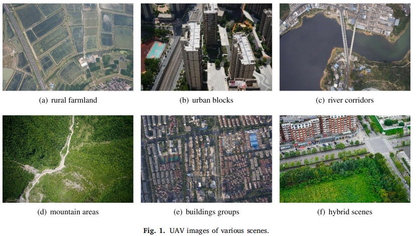
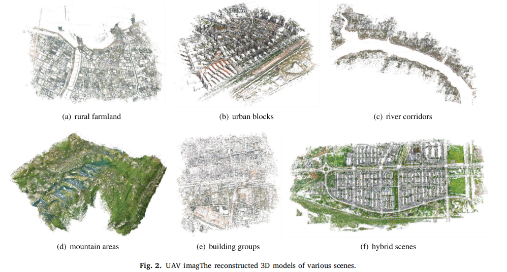

# UAVPairs: A Benchmark for Match Pair Retrieval of Large-scale UAV Images





## About

UAVPairs is a large-scale benchmark dataset designed for match pair retrieval of large-scale UAV images. It contains 21,622 high-resolution aerial images captured from 30 diverse scenes, covering urban blocks, rural farmland, river corridors, mountain areas, and other mixed terrains. Each scene is photographed from multiple scales and perspectives with substantial geometric overlap using multi-view oblique photogrammetry setups. Unlike previous retrieval datasets based on semantic labels or mesh projections, UAVPairs employs SfM-based 3D reconstruction to define geometric similarity between images, ensuring that the annotated image pairs are truly matchable in structure-from-motion applications.  UAVPairs serves as a comprehensive benchmark for evaluating and training deep global feature models in UAV-based 3D reconstruction and geometry-aware retrieval tasks. If you find this dataset useful in your research, please cite:

```tex
@article{liu2025uavpairs,
  title={UAVPairs: A benchmark for match pair retrieval of large-scale UAV images},
  author={Liu, Junhuan and Jiang, San and Ge, Wei and Huang, Wei and Guo, Bingxuan and Li, Qingquan},
  journal={ISPRS Journal of Photogrammetry and Remote Sensing},
  volume={230},
  pages={227--240},
  year={2025},
  publisher={Elsevier}
}
```

## Dataset

https://data.mendeley.com/datasets/2x67rch5ys/2

https://drive.google.com/file/d/18c7-QnU7vKB4VmsfYCMlBolpbnb11IkG/view?usp=drive_link

```
uavpairs                          
 ├── trainset
       ├── images
       		├── samllscale/*
       		└── largescale/*
       ├── true_pair_100.txt
       ├── test.mat
       ├── HardNegativeSample_train2.mat
       └── BatchedNontrivialSample_train2.mat
 └── testset
       ├── images
       		├── cug/*
       		├── szu/*
       		└── 2w_B/*
       ├── database
       		├── campus_test.db
       		├── szu_test.db
       		└── 2w_B_test.db
       ├── exhaustive
       		├── exhaustive_pair
       		└── exhaustive_inlier
       └── ground_truth_based_on_bow
 		
```

| File Name                                   | Descriptions                                                 |
| ------------------------------------------- | ------------------------------------------------------------ |
| trainset/images                             | 480 x 320 downsampled images for training                    |
| trainset/true_pair_100.txt                  | the ground truth generated based on BoW for validation       |
| trainset/test.mat                           | 5 times downsampled images for validation                    |
| trainset/HardNegativeSample_train2.mat      | training samples for hard negative sample mining             |
| trainset/BatchedNontrivialSample_train2.mat | training samples for batched non-trivial sample mining       |
| testset/images                              | 5 times downsampled images for testing                       |
| testset/database                            | the databases of the three test sets                         |
| testset/exhaustive/exhaustive_pair          | the retrieved pairs of the three test sets obtained by different models |
| testset/exhaustive/exhaustive_inlier        | the inlier pairs obtained from feature matching of the retrieved pairs |
| testset/ground_truth_based_on_bow           | ground truth obtained by performing SfM reconstruction on the top 100 pairs retrieved using BoW, for quickly validation or testing |

## Checkpoints

https://pan.quark.cn/s/584139b94bf6

```
checkpoints                          
 ├── centroids  # cluster centroids for NetVlad
 └── runs/*     # checkpoints of training
       ├── RankedList_Resnet50_MaxPooling
       ├── RankedList_VGG16_GeM
       ├── RankedList_VGG16_NetVlad
       ├── Triplet_MBN_Resnet50_MaxPooling
       ├── Triplet_MBN_VGG16_GeM
       ├── Triplet_MBN_VGG16_NetVlad
       ├── Triplet_Resnet50_MaxPooling
       ├── Triplet_VGG16_GeM
       └── Triplet_VGG16_NetVlad

```

## Usage

### Train

After downloading the project and dataset, change the paths in the training files:

```
DatasetDir = "F:/ljh/dataset/netvlad_train/uavpairs"
ProjectDir = "F:/ljh/Code/UAVPairs-main"

EncoderType = "VGG16"		# "VGG16"or"Alexnet"or"Resnet"
PoolingType = "NetVlad"		# "MaxPooling"or"NetVlad"
```

```
python BatchedNontrivialSample/RankedListModelTrain.py
```

```
python HardNegtiveSample/HardTModelTrainMultiN.py
```

### Test

1. Global feature extraction

   ```
   python ModelTest/ModelTest.py
   ```

2. Retrieve match pairs

   ```
   python Retrieval/exhaustive.py
   ```

3. Feature matching and exporting inlier pairs

   Perform feature matching and export inlier pairs using ParallelSfM https://github.com/json87/ParallelSfM or COLMAP https://github.com/colmap/colmap

4. Accuracy computation

   ```
   python Retrieval/accuracy.py
   ```

## Reference

```
@article{liu2025uavpairs,
  title={UAVPairs: A benchmark for match pair retrieval of large-scale UAV images},
  author={Liu, Junhuan and Jiang, San and Ge, Wei and Huang, Wei and Guo, Bingxuan and Li, Qingquan},
  journal={ISPRS Journal of Photogrammetry and Remote Sensing},
  volume={230},
  pages={227--240},
  year={2025},
  publisher={Elsevier}
}

@article{jiang2024efficient,
  title={Efficient structure from motion for UAV images via anchor-free parallel merging},
  author={Jiang, San and Ma, Yichen and Jiang, Wanshou and Li, Qingquan},
  journal={ISPRS Journal of Photogrammetry and Remote Sensing},
  volume={211},
  pages={156--170},
  year={2024},
  publisher={Elsevier}
}

@article{jiang2023efficient,
  title={Efficient match pair retrieval for large-scale UAV images via graph indexed global descriptor},
  author={Jiang, San and Ma, Yichen and Liu, Junhuan and Li, Qingquan and Jiang, Wanshou and Guo, Bingxuan and Li, Lelin and Wang, Lizhe},
  journal={IEEE Journal of Selected Topics in Applied Earth Observations and Remote Sensing},
  volume={16},
  pages={9874--9887},
  year={2023},
  publisher={IEEE}
}

@article{jiang2022parallel,
  author={Jiang, San and Li, Qingquan and Jiang, Wanshou and Chen, Wu},
  title={Parallel Structure From Motion for UAV Images via Weighted Connected Dominating Set}, 
  journal={IEEE Transactions on Geoscience and Remote Sensing}, 
  volume={60},
  pages={1-13},
  year={2022},
  publisher={IEEE}
}
```
